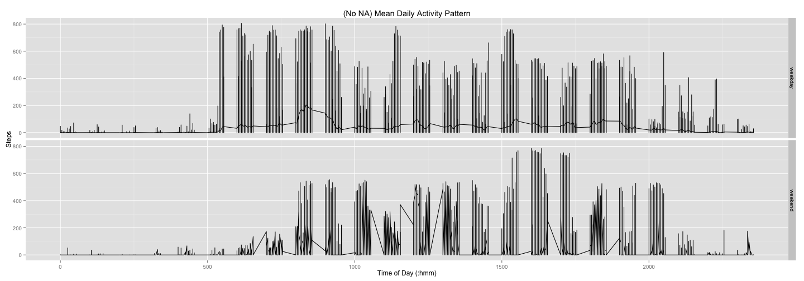

## Loading and preprocessing the data


```r
require(dplyr)
require(ggplot2)
```


```r
unzip("activity.zip")
raw <- read.csv("activity.csv")
raw <- transform(raw, date=as.Date(raw$date, "%Y-%m-%d"))
activity <- raw
```

## What is mean total number of steps taken per day?


```r
by_day <- group_by(activity, date)
by_day <- na.omit(by_day)
by_day <- summarise(by_day, steps = sum(steps))
ggplot(by_day, aes(x=date, y=steps)) +
  geom_histogram(stat="identity", binwidth=1, colour="black", fill="white") +
  labs(x="Day", y="Steps") +
  ggtitle("Total Steps Per Day")
```

 

```r
mean_by_day <- mean(by_day$steps, na.rm=TRUE)
median_by_day <- median(by_day$steps, na.rm=TRUE)
print(paste("Mean By Day: ", mean_by_day))
```

```
## [1] "Mean By Day:  10766.1886792453"
```

```r
print(paste("Median By Day: ", median_by_day))
```

```
## [1] "Median By Day:  10765"
```

## What is the average daily activity pattern?


```r
by_interval <- group_by(activity, interval)
mean_by_interval <- summarise(by_interval, steps=mean(steps, na.rm=TRUE))
plot(levels(as.factor(mean_by_interval$interval)), mean_by_interval$steps, 
    type="l",
    xlab="Time of Day (:hmm)",
    ylab="Mean Steps",
    main="Mean Daily Activity Pattern")
```

 

```r
max_steps_interval <- mean_by_interval[match(max(mean_by_interval$steps), mean_by_interval$steps),]
print(paste("Max Steps Interval: ", max_steps_interval[1]))
```

```
## [1] "Max Steps Interval:  835"
```

## Imputing missing values


```r
act_1 <- raw
na_count <- sum(is.na(act_1))
print(paste("Missing Values Count: ", na_count))
```

```
## [1] "Missing Values Count:  2304"
```

```r
print("Using a mean by day strategy to replace NAs...")
```

```
## [1] "Using a mean by day strategy to replace NAs..."
```

```r
for (i in 1:nrow(act_1)) {
  if (is.na(act_1$steps[i])) {
    act_1$steps[i] <- as.numeric(filter(mean_by_interval, interval==as.numeric(act_1[i,][3]))[2])
  }
}
act_1_by_day <- group_by(act_1, date)
act_1_by_day <- summarise(act_1_by_day, steps = sum(steps))
ggplot(act_1_by_day, aes(x=date, y=steps)) +
  geom_histogram(stat="identity", binwidth=1, colour="black", fill="white") +
  labs(x="Day", y="Steps") +
  ggtitle("(No NA) Total Steps Per Day")
```

 

```r
act_1_mean_by_day <- mean(act_1_by_day$steps, na.rm=TRUE)
act_1_median_by_day <- median(act_1_by_day$steps, na.rm=TRUE)
print(paste("(No NA) Mean By Day: ", act_1_mean_by_day))
```

```
## [1] "(No NA) Mean By Day:  10766.1886792453"
```

```r
print(paste("(No NA) Median By Day: ", act_1_median_by_day))
```

```
## [1] "(No NA) Median By Day:  10766.1886792453"
```

```r
print("Because a mean NA-filling strategy was used here, the modified mean remains; modified total steps and median increase.")
```

```
## [1] "Because a mean NA-filling strategy was used here, the modified mean remains; modified total steps and median increase."
```

## Are there differences in activity patterns between weekdays and weekends?


```r
act_1 <- mutate(act_1, day=weekdays(act_1$date))
act_1 <- mutate(act_1, weekday=factor(ifelse(
    day %in% c("Sunday","Saturday"),
      "weekend",
      "weekday"
    )))
ggplot(act_1, aes(x=interval, y=steps)) + 
  geom_line() + 
  facet_grid("weekday ~ .") +
  labs(x="Time of Day (:hmm)", y="Steps") +
  ggtitle("(No NA) Mean Daily Activity Pattern")
```

 
